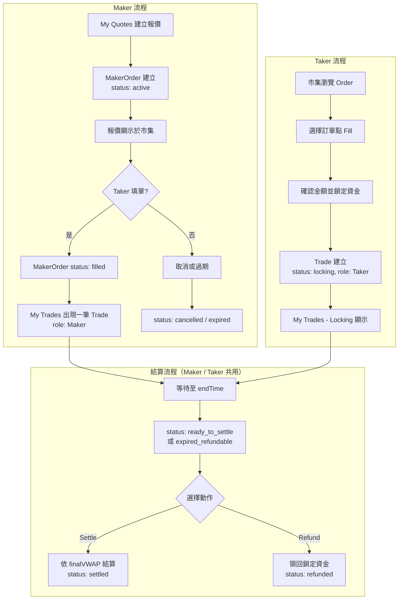
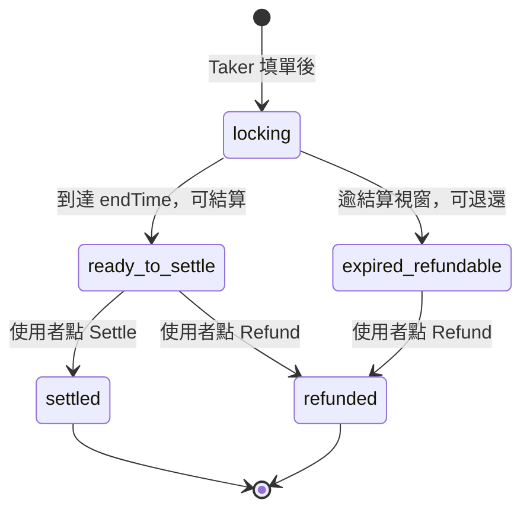
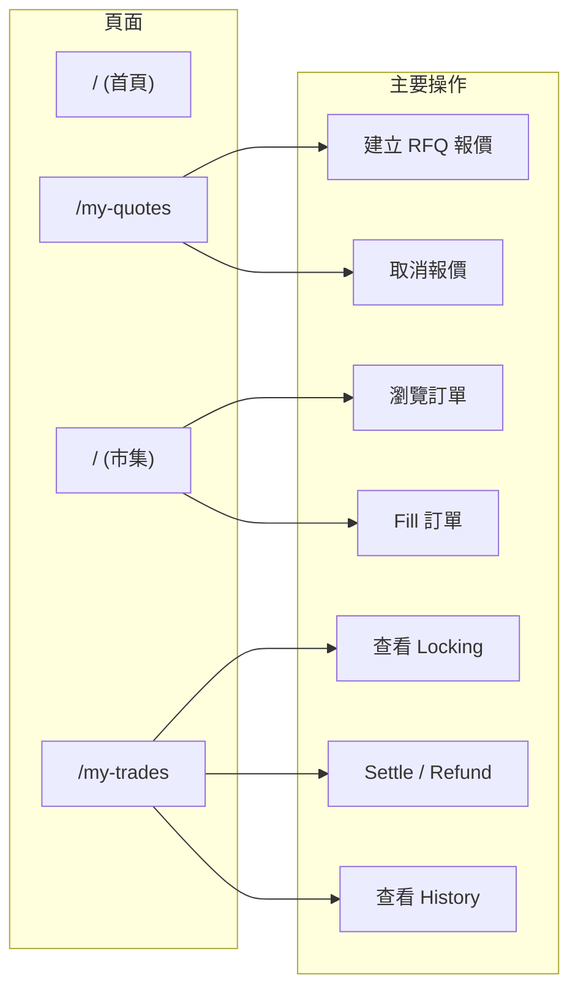
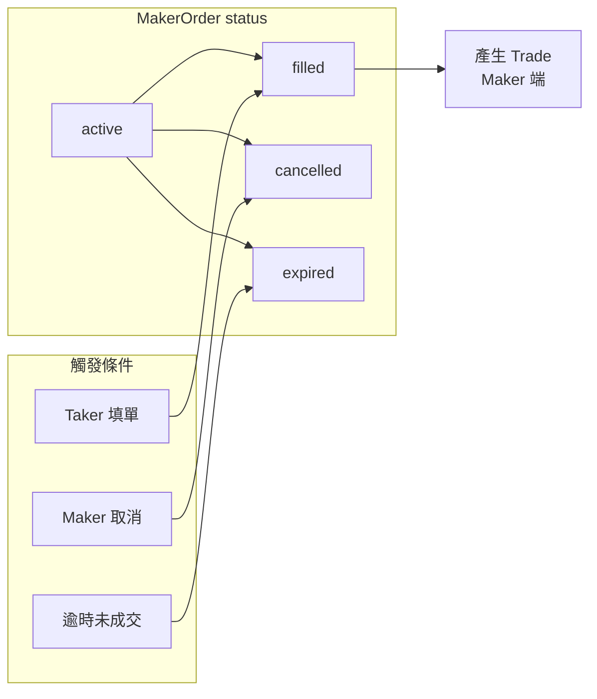

# 整體操作流程圖

本文件以流程圖說明 Chainlink VWAP 前端的整體操作邏輯：Maker 報價、Taker 填單、鎖倉與結算／退還。

## 高層流程（泳道圖）

## 交易狀態流（Trade 狀態機）

## 頁面與操作對照

## MakerOrder 狀態與 Trade 的對應

## 資料流摘要

1. **Maker**：在 My Quotes 建立 MakerOrder（active）→ 顯示於市集 → 被填單後變 filled，並在 My Trades 出現一筆 Trade（Maker）。
2. **Taker**：在市集選擇 Order → Fill → 鎖定資金後在 My Trades 出現一筆 Trade（Taker），狀態為 locking。
3. **雙方**：鎖倉至 endTime 後，Trade 變為 ready_to_settle 或 expired_refundable，可選擇 Settle（依 VWAP 結算）或 Refund（退還），完成後為 settled 或 refunded。

流程圖使用 Mermaid，可在支援 Mermaid 的 Markdown 預覽或文件中直接渲染（如 GitHub、GitLab、VS Code 外掛等）。
